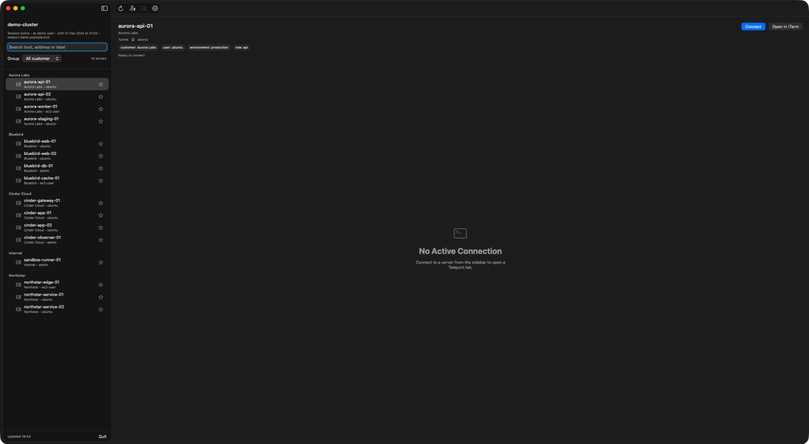
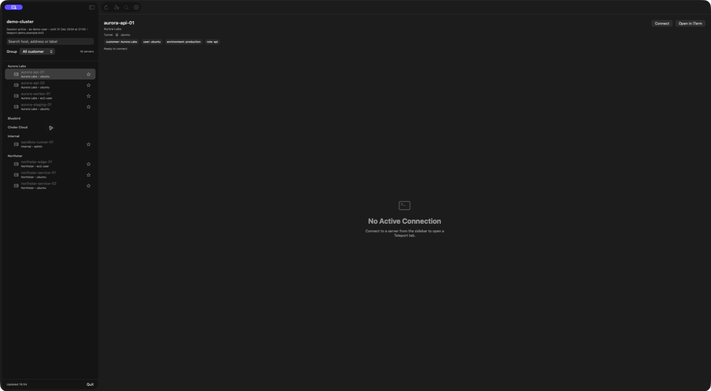

# Teleport Desktop

<p align="center">
  A native macOS workspace for browsing Teleport nodes and running SSH sessions through <code>tsh</code>.
</p>

> [!IMPORTANT]
> **Teleport Desktop is an independent community project.** It is not affiliated
> with, endorsed by, sponsored by, or maintained by [Teleport](https://goteleport.com/).
> Teleport and `tsh` are trademarks or products of their respective owners.

Teleport Desktop fills a small but noticeable gap in the Teleport workflow: `tsh`
is an excellent command-line client, but moving between many nodes, labels,
accounts, and concurrent sessions can still require a lot of terminal navigation.
This app adds a focused macOS interface on top of the existing CLI instead of
reimplementing Teleport.

It discovers your active profile and nodes through `tsh`, then uses `tsh` behind
the scenes for login, SSH, and file transfers. Your Teleport cluster remains the
source of truth for authentication and access.

## Screenshots

| Browse nodes by label | Expand and collapse groups |
| --- | --- |
|  |  |

> All clusters, groups, usernames, addresses, and nodes shown above are fictional
> demo data.

## Why Teleport Desktop?

- Browse nodes without repeatedly running `tsh ls`.
- Group and filter large node lists using Teleport labels.
- Keep several embedded SSH sessions open in tabs.
- Rename nodes locally with names that make sense to you.
- Jump back to favorites and recently used nodes.
- Upload and download files through `tsh scp`.
- Open a session in Terminal, iTerm2, Warp, or another supported terminal.

Teleport Desktop does not replace `tsh`. It provides a native interface for the
workflows you already use and delegates the actual Teleport operations to the CLI.

## Features

### Node browser

- Reads the active Teleport session and available SSH nodes.
- Searches hostnames, addresses, labels, and local names.
- Groups nodes by a configurable label such as `customer` or `environment`.
- Supports collapsible groups, favorites, and a separate recent-nodes list.
- Stores custom node names locally and keeps them across app restarts.

### Terminal workspace

- Opens `tsh ssh` sessions in an embedded terminal.
- Supports multiple tabs and keyboard navigation between them.
- Resolves SSH logins from a configurable node label, with a fallback login.
- Can hand sessions off to an external terminal application.

### File transfers

- Uploads and downloads files with `tsh scp`.
- Shows transfer progress when `tsh` reports it.
- Supports cancelling an active transfer.

## How it works

Teleport Desktop calls the locally installed `tsh` executable:

| Task | Command used |
| --- | --- |
| Read the active profile | `tsh status --format=json` |
| Discover nodes | `tsh ls --format=json` |
| Authenticate | `tsh login` |
| Connect to a node | `tsh ssh` |
| Transfer files | `tsh scp` |

The app does not implement the Teleport protocol, manage cluster-side resources,
or bypass Teleport's authentication and authorization model.

## Requirements

- macOS 14 Sonoma or newer.
- A working Teleport setup and access to a Teleport cluster.
- [`tsh`](https://goteleport.com/docs/connect-your-client/tsh/) installed and
  available in `PATH`.
- Xcode Command Line Tools when building from source.

Confirm that the CLI is available and that you have an active profile:

```bash
tsh version
tsh status
```

If needed, authenticate before opening the app:

```bash
tsh login --proxy=teleport.example.com
```

## Build from source

Clone the repository and run the included build script:

```bash
git clone https://github.com/kernelp4nic/teleport-desktop.git
cd teleport-desktop
./script/build_and_run.sh
```

The script builds the Swift package, creates the app bundle under `dist/`, and
opens it.

To run the test suite:

```bash
swift test
```

> [!NOTE]
> Prebuilt, signed, and notarized releases are not available yet.

## Configuration

Open **Settings** to configure:

- **Proxy** — optionally override the proxy from the active `tsh` profile.
- **Grouping label** — choose the node label used to create sections.
- **Login label** — choose the label used to resolve the SSH username.
- **Fallback login** — provide a default when a node has no matching label.
- **Terminal application** — choose where external sessions should open.

Node names, favorites, and recent-node history are local preferences. Renaming a
node changes only its display name in Teleport Desktop; connections still use the
real hostname reported by Teleport.

## Project status

Teleport Desktop is an early-stage project built to solve a real workflow need.
Interfaces, storage formats, and behavior may change while the project matures.

Good next steps include:

- Signed and notarized release builds.
- Automated GitHub releases.
- Broader accessibility and keyboard-navigation coverage.
- More tests around desktop interaction and long-running transfers.

Issues and focused pull requests are welcome.

## Contributing

1. Open an issue describing the problem or proposed improvement.
2. Keep changes focused and avoid unrelated refactors.
3. Add or update tests when behavior changes.
4. Run `swift test` before opening a pull request.
5. Explain any user-facing changes and include screenshots when relevant.

Please do not include cluster addresses, usernames, access tokens, certificates,
or other sensitive Teleport information in issues, logs, or screenshots.

## Security

If you believe you found a security issue, do not publish credentials or private
cluster details in a public issue. Until a private reporting policy is added,
share only a minimal, redacted description with the maintainer.

## Acknowledgements

- [Teleport](https://goteleport.com/) for the Teleport platform and `tsh` CLI.
- [SwiftTerm](https://github.com/migueldeicaza/SwiftTerm) for the embedded terminal
  component.

## License

This repository does not currently include an open-source license. Until one is
added, the source remains subject to standard copyright restrictions. Add a
`LICENSE` file before presenting the project as open source.
